# A technical zoom-in to NEM

This article aims to provide a technical zoom-in on the [NEM NIS code](https://github.com/NemProject/nem) in order to better understand how things fit together and give readers the leads to more easily delve into further research.

## Tech Stack

- Java 8 (Java 11 in dev branch)
- Spring Framework (v4.3.30)
- Jetty Web Server (v9.4.43)
- Hibernate ORM (v4.3.11)
- H2 Database (v1.4.200)
- Flyway for database migration
- Maven for dependency and build management

## High Level View
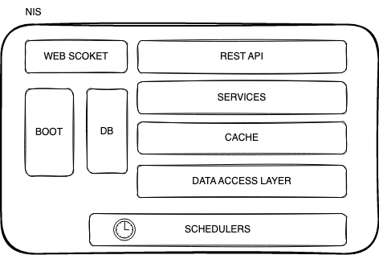
## Modules


The NEM codebase is organized into several modular packages, each of which serves a specific function within the overall platform. Here's a brief overview of some of the main modules.

### Core
Packages within this module starts with `org.nem.core`. These packages provide the following functionality:
- cryptographic and serialization base methods
- timer and async classes/helpers
- data types for transaction, states and node
- time provider and synchronization
- common utility (collections, encoders)

### Peer
Packages within this module starts with `org.nem.peer`. This module provides base methods for
- synchronization, network state
- connection to nodes
- authentication on nodes
- reputation management algorithm implementation (EigenTrust)

### Deploy
 Packages within this module starts with `org.nem.deploy`\
 Main functionalities are, Logging, bootstrapping, serialization, property file handling and server instantiation.

### NIS
(NEM Infrastructure Server) NIS is the core component of the NEM platform, responsible for maintaining the integrity and security of the blockchain. It handles tasks such as validating transactions, creating new blocks, and managing the overall state of the network depending on the `core`, `deploy`, `peer` modules.
This Java package provides everything needed to launch a NEM node.

## Building from source
```bash
git clone https://github.com/NemProject/nem.git
cd nem
mvn clean package -DskipTests
```
## Bootstrapping NIS
In the NEM blockchain, `CommonStarter` class(_main_) is the entry point to bootstrapping NEM Infrastructure Server (NIS) node.

To bootstrap a NIS node, the CommonStarter class performs the following tasks:
- instantiates the ApplicationContext and loads configuration
   - `NisAppConfig` class instantiates beans(objects managed by the Spring IOC)
     - Datasource
     - DB migration (flyway)
     - Blockchain objects
     - Cache
     - Harvester
     - NisMain (*important please see `NisMain.init` method which runs on PostConstruct)
     - and more
- instantiates `NemServerBootstrapper` for http server
- instantiates `NemWebsockServerBootstrapper` for web socket server

Here is how you can start a NIS node:
```java
java -Xms6G -Xmx6G -cp classpath_libs org.nem.deploy.CommonStarter
```
Ideally it will require min 6GB of RAM to run a NIS node in a production environment.

## Configuration

There are several configuration files within the NEM codebase:
- config(.*).properties
- db.properties
- logalpha.properties

_In order to overwrite any of the configuration, the files must be located in the classpath._
### config(.*).properties file
Here is the configuration hierarchy for `config.properties`:
```
NisConfigurationPolicy
  NisConfiguration
    CommonConfiguration
      merge:
        config-default.properties
        config.properties
        config-user.properties
```
Within the hierarchy `config.properties` will overwrite the `config-default.properties` and `config-user.properties` _if defined_ will overwrite the values in `config.properties`.

Here is the list of possible values to configure:
```properties
nem.folder = %h/nem
nem.protocol = http
nem.host = 127.0.0.1
nem.httpPort = 7890
nem.httpsPort = 7891
nem.websocketPort = 7778
nem.network.nemesisFilePath:
nis.bootKey:
nis.bootName:
...
```

### db.properties file
This file contains the database connection configuration. Usually the values in this file don't need to be updated.\
Here is the default configuration file content:
```
jdbc.driverClassName=org.h2.Driver
jdbc.url=jdbc:h2:${nem.folder}/nis/data/nis5_${nem.network};DB_CLOSE_DELAY=-1
jdbc.username=
jdbc.password=

hibernate.dialect=org.hibernate.dialect.H2Dialect
hibernate.show_sql=false
hibernate.use_sql_comments=false
hibernate.jdbc.batch_size=20
hibernate.query.startup_check=false

flyway.locations=db/h2
```

### logalpha.properties
NEM uses `java.util.logging`. Default logging level is `INFO`.

If it's needed to change the default logging level, one of the levels listed below can be used.
```
OFF
SEVERE
WARNING
INFO
CONFIG
FINE
FINER
FINEST
ALL
```

Here is the default configuration file:
```properties
handlers = java.util.logging.ConsoleHandler, java.util.logging.FileHandler
.level = INFO

java.util.logging.ConsoleHandler.formatter = org.nem.deploy.ColorConsoleFormatter
java.util.logging.ConsoleHandler.level = INFO

java.util.logging.FileHandler.formatter = org.nem.deploy.NemFormatter
java.util.logging.FileHandler.limit = 100000000
java.util.logging.FileHandler.count = 100
java.util.logging.FileHandler.pattern = ${nem.folder}/nis/logs/nis-%g.log

java.util.logging.SimpleFormatter.format = %1$tY-%1$tm-%1$td %1$tH:%1$tM:%1$tS.%1$tL %4$s %5$s%6$s (%2$s)%n
```

## REST API
REST API Controllers reside under `org.nem.nis.controller` package.
Some of the Controller classes are:
- AccountController
- AccountInfoController
- AccountTransfersController
- BlockController
- ChainController\
 ...\
Let's focus on one of the controllers and bring `AccountTransfersController` under spotlight.

First off, all of the REST controllers are annotated with `@RestController` which is a Spring Web Framework annotation that is indicating that the class is a controller that serves RESTful web services and the methods in the class will handle web requests and return the response body.

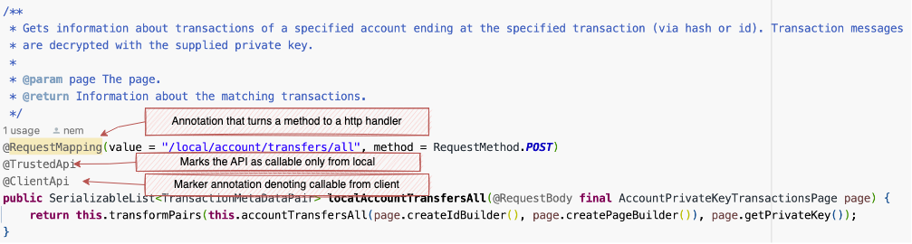

NEM API annotations:
- AuthenticatedApi: Expects a node challenge param(a random 64-byte payload), signs the challenge data with the private key, attaches signature to the response for the caller to verify
- P2PApi: Marker annotation denoting callable by peers
- ClientApi: Marker annotation denoting the api is callable by the client
- PublicApi: Marker annotation for a public api (should be all GET method based), any PublicApi is also a ClientApi
- TrustedApi: Allows only local callers (prevent remote callers)

You can search for these annotations to find related API endpoints in the code.

For P2P endpoints please see `org.nem.core.node.NisPeerId` class and also `org.nem.core.connect.client.NisApiId` for the client API endpoints.


## How does peer to peer communication work?
When the node boots, during the peer network boot, it loads the initial(pre-trusted) peer list from the `peer-config_[mainnet|testnet].json` file.

During the boot there is a scheduled task created with the name `REFRESH` (in `PeerNetworkScheduler.addTasks`) to refresh the peer nodes.

`NodeRefresher` (triggered by the scheduled task `REFRESH`) refreshes the peer list, by making authenticated calls to `node/info` and `/node/peer-list/active` and stores the info in the local cache on a peer (selected using `PreTrustAwareNodeSelector`).

Peers call `@P2PApi` annotated API endpoints, mostly authenticated by sending a challenge and verifying the returned signature(whether signed by the expected node).

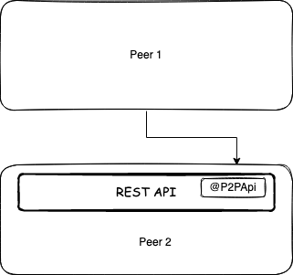

## How does a peer trust a peer? EigenTrust algorithm, Node Experiences
During the boot, there is a scheduled task `updateNodeExperiences` created with a complex delay strategy _can be seen below_.

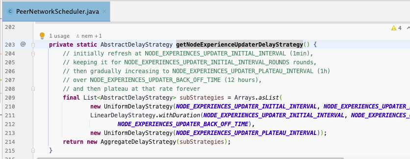

When this task is triggered, `NodeExperiencesUpdater` makes an authenticated call to `/node/experiences` on a peer (selected using `PreTrustAwareNodeSelector`) and stores the `NodeExperiencesPair`(which then will be used to calculate the trust score to the nodes) in the local cache.

`NodeExperience` represents experience one node has with another node and consists of `successfulCalls`, `failedCalls` and `lastUpdateTime` fields.

Then this information is used in the trust score calculation.

### Eigentrust(++) Algorithm
EigenTrust++ is a reputation management algorithm that was developed to improve the accuracy and efficiency of reputation systems in peer-to-peer (P2P) networks. It is based on the idea of using the collective behavior of a group of peers to evaluate the trustworthiness of individual peers.

> “Having a reputation system for nodes allows nodes to select their communication partner according to the trust values for other nodes. This should also help balance the load of the network because the selection of the communication partner only depends on a node’s honesty but not its importance.”\
 https://nemproject.github.io/nem-docs/pages/Whitepapers/NEM_techRef.pdf

The EigenTrust++ algorithm uses a combination of local and global reputation information to calculate the reputation of a node. Local reputation is based on the direct interactions of a node with its neighbours, while global reputation is based on the collective behaviour of the entire network.

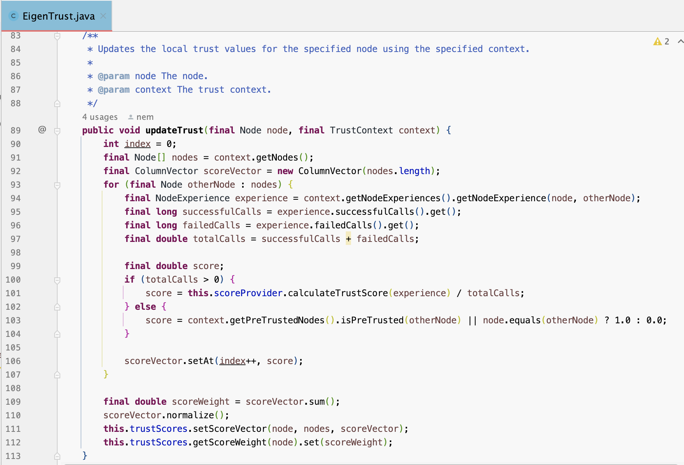

In the `EigenTrust` algorithm, malicious nodes could collude and report
low trust values for honest nodes and high trust values for dishonest nodes. To mitigate this risk NEM uses `EigenTrust++` algorithm which additionally calculates and uses a node's credibility based on the shared experiences of that node with other nodes; if the experiences are similar then we can say the node is more credible/honest.

`EigenTrustPlusPlus` class extends `EigenTrust` class in the NEM code.

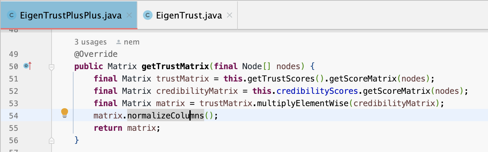

Before any peers picked by the local node to interact with, it picks the peer considering the trust score of the candidate peer.

## Block synchronization
As already mentioned, recurring tasks are being handled with the scheduled tasks that are created in the `PeerNetworkScheduler` class.

One of the scheduled tasks is `PeerNetwork.synchronize()` with the name `SYNC` which is scheduled to run every 3 seconds.

This scheduled task runs  `BlockChain.synchronizeNode` in the end, as it can be seen in the following image _call hierarchy_.

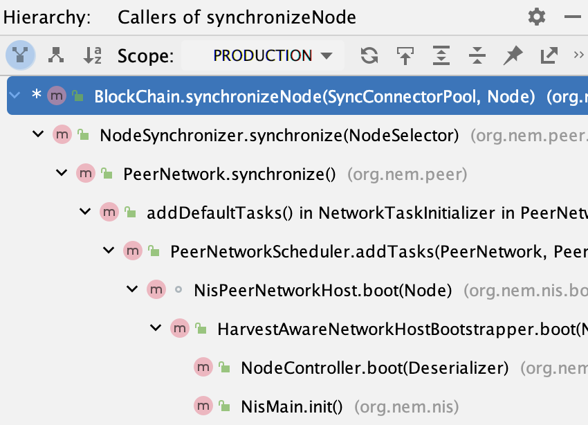

Block synchronization logic can be seen in the following image.
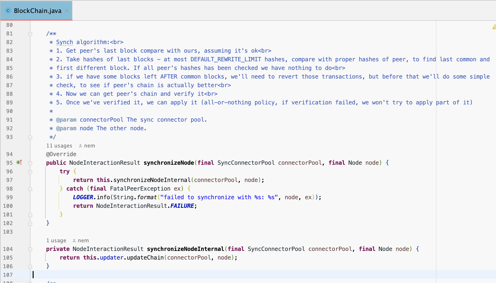

One thing to note is, during synchronization when `BlockChainConfigurationBuilder.blockChainRewriteLimit`(default 360) is exceeded the synchronization will not be successful(which will require a synch from scratch).

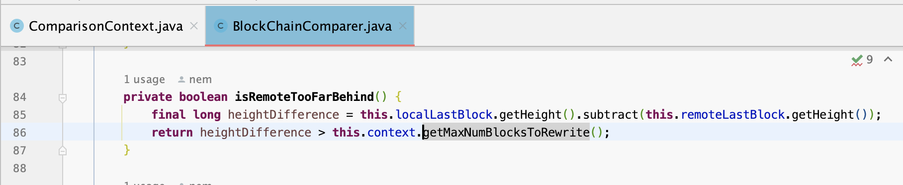

## Broadcasting data
The data(Transaction(s), block(s)) to be broadcast is enqueued to `BroadcastBuffer`.
The scheduled task with the name `BROADCAST BUFFERED ENTITIES` pushes the buffered entities to the peers _every second_.
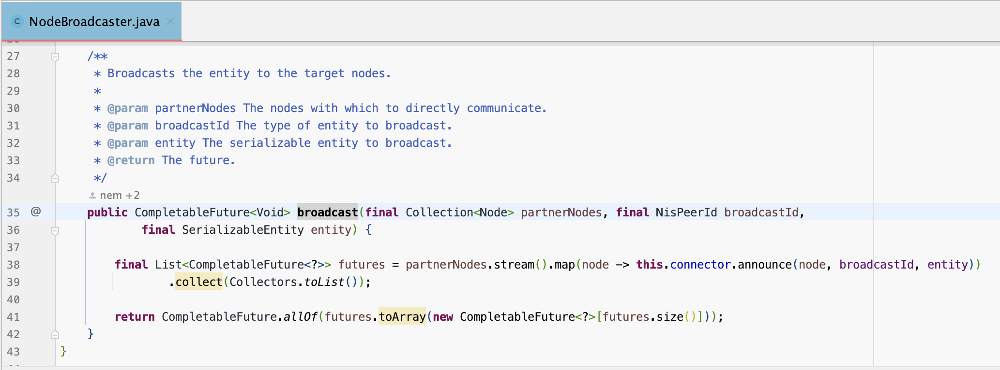
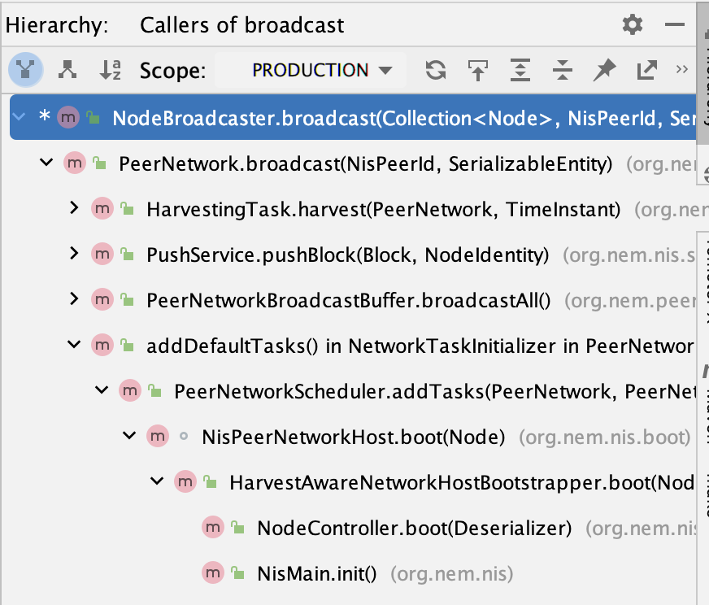
`PushService.pushTransaction()` and `PushService.pushBlock()` methods are being utilized through the process.

## Time synchronization
NEM blockchain uses a custom time synchronization logic which is triggered by a scheduled task named `TIME SYNCHRONIZATION`. It starts with synchronizing every minute then over time, after getting mature, it starts to sync every 9 hours.

See the below image explaining the time synchronization logic(read more on https://nemproject.github.io/nem-docs/pages/Whitepapers/NEM_techRef.pdf).

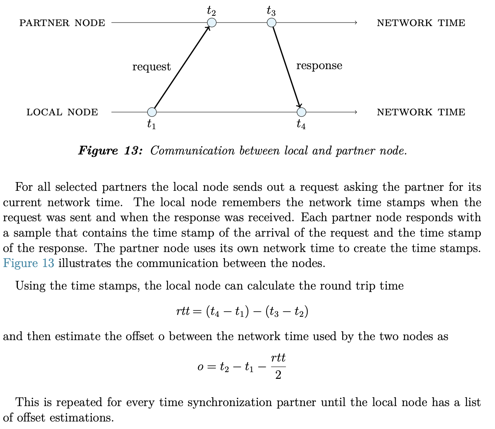

See `NisTimeSynchronizer` class which does the time sample collection in the code.
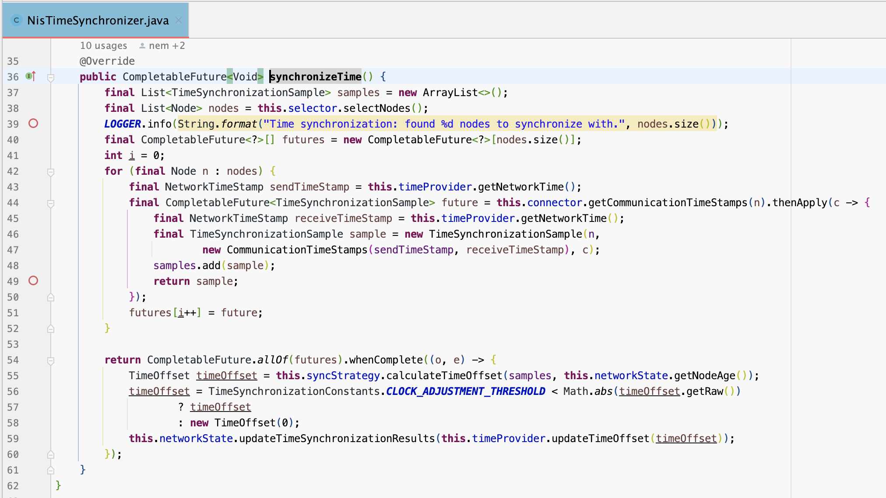

## Harvesting

There is a scheduled task called `FORAGING` which is responsible for running the harvesting logic _every second_(see `PeerNetworkScheduler.addForagingTask`).

`HarvestingTask.harvest` method is being called by this scheduled task, which drops the expired transactions first, then tries to harvest a block for every `unlockedAccount`(accounts that are delegating to that node).

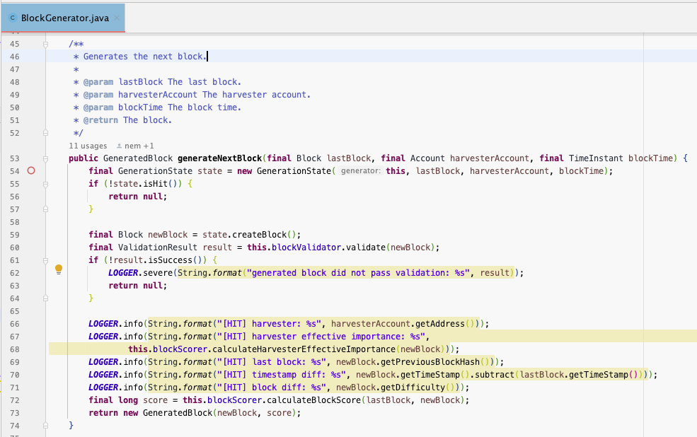

`state.isHit()` method checks if the calculated `hit` is lower than the `target` then it's a `hit`, meaning it is a successful candidate block; if the all of the below validations passes and block score is the best amongst other candidates.

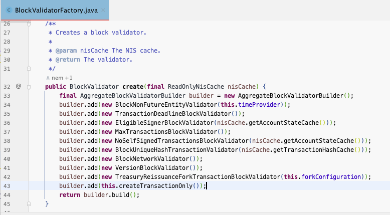

Here is how the `hit` and `target` values are calculated:
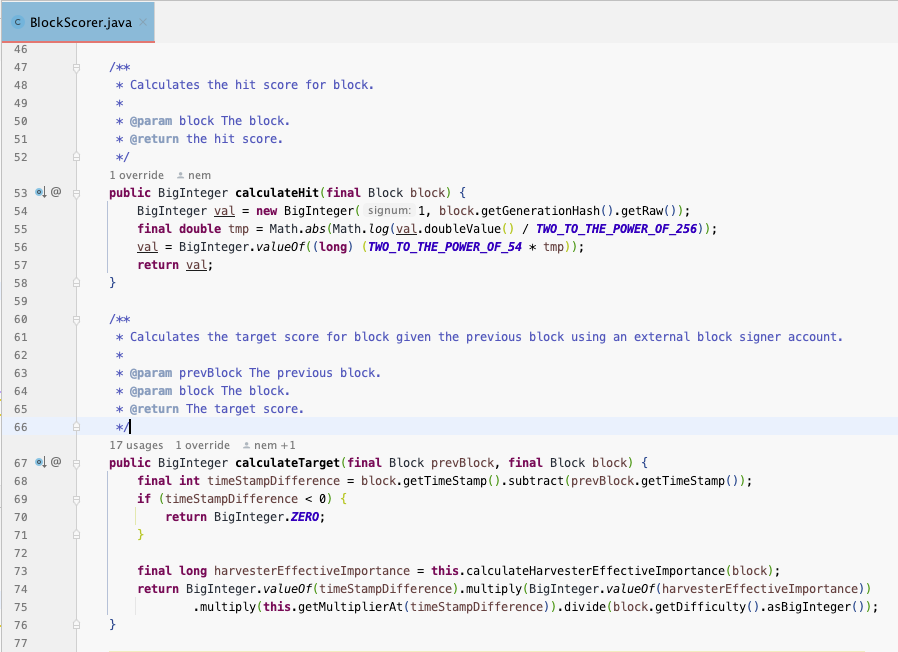

## Wrapping up

I tried to take a closer look at NEM codebase in this article. I'm sure it is barely a scratch on the surface. The goal here was to expose some leads for you to follow easier for a better understanding in a short article. I hope it helps :)\
Thank you for reading!
